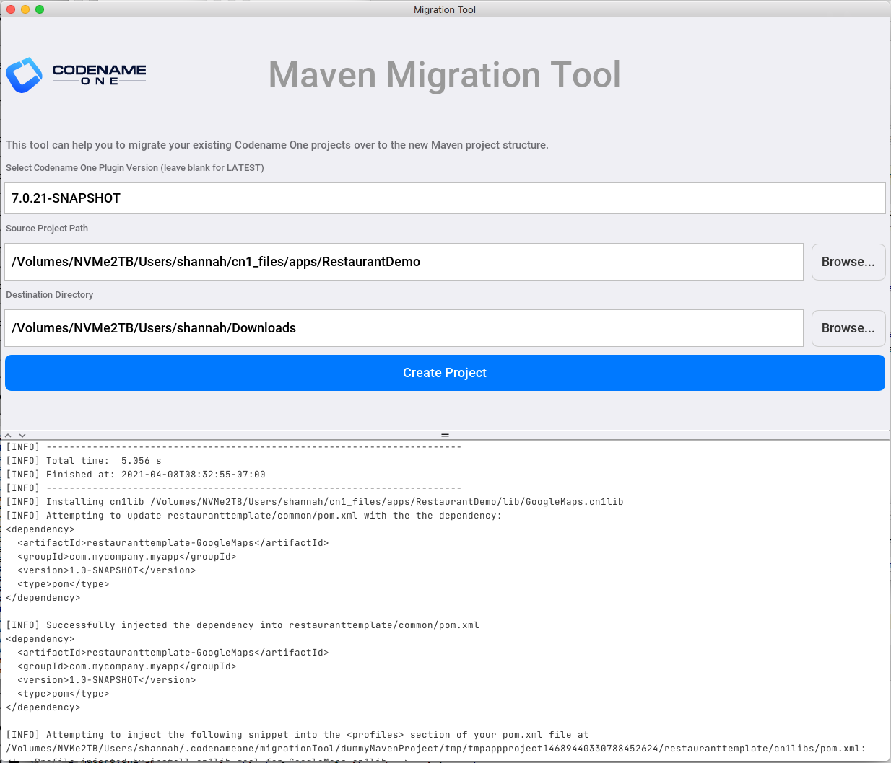
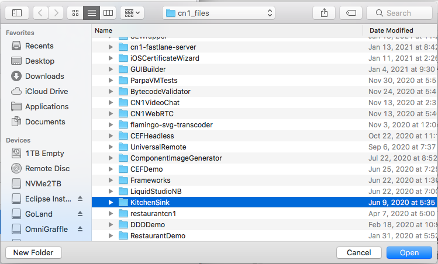
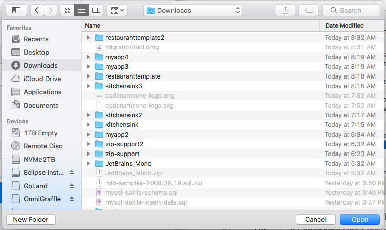
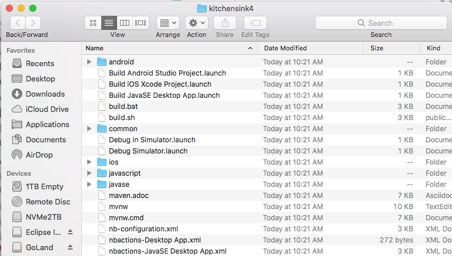

= Codename One Maven Migration Tool

This is a desktop GUI application that simplifies the migration of legacy Codename One projects that used the Ant build tool to the https://www.codenameone.com/blog/moving-to-maven.html[new Maven project format].

Essentially this just wraps the _https://shannah.github.io/codenameone-maven-manual/#generate-app-project[generate-app-project]_ and _https://shannah.github.io/codenameone-maven-manual/#_generate_cn1lib_project_generate_cn1lib_project[generate-cn1lib-project]_ goals of the Codename One maven plugin to make them easier to use.

TIP: This tool is for migrating _existing_ projects to Maven.  To start a new project from scratch, you can use the https://start.codenameone.com[Codename One initializr] online tool.

== License

MIT

== Downloads

See the https://github.com/shannah/maven-migration-tool/releases[releases page].

== Usage

Open the Maven Migration Tool App.  It will open  window that looks like:

You can explicitly specify the plugin version you wish to use for generating the maven project.  If you leave this field blank or enter "LATEST", it will automatically use the latest release version in Maven Central.  Usually you will want to use the latest version.  If you are working with a SNAPSHOT version of Codename One, then you may enter that snapshot version in the field.

Next you should select the source project (i.e. the Codename One project that you wish to convert to Maven) by pressing the _Browse..._ button to the right of the "Source Project Path" field.

TIP: The source project can be either a Codename One Application project, or a Codename One Library project.  The Migration tool will automatically perform the correct conversion according to the project type.

Next you should select the _destination directory_ for the Maven project by pressing the _Browse..._ button to the right of the _Destination Directory_ text field.

NOTE: The destination directory must exist.  The maven project will be created inside this directory named after the _artifactId_ you choose for the project.  E.g. If you select _/home/Downloads_ as the destination directory, and the _artifactId_ is "myapp", then your project will be created at _/home/Downloads/myapp_.

If this is a library project, you will see two additional fields to fill in, _Group ID_ and _Artifact ID_.  These are the values that will be used for the maven project.

NOTE: Application projects will use the _packageName_ and _mainName_ values from the _codenameone_settings.properties_ file of the project as the _groupId_ and _artifactId_ fields respectively.  Therefore this section of the form will not be visible if you select an Application project.

Once you have filled in the fields, press the _Create Project_ button.

The maven output will be logged in the console at the bottom of the window.

image::images/console-output.png[]

If the migration completes successfully, you should see dialog stating that the conversion was a success.

Upon disposing this dialog, it will open the project directory in the file system explorer.

This new project does not depend on the original project at all, so you can archive the old project away, and start working with the new project.

This project structure is based on the bare-bones project template.  See the https://shannah.github.io/cn1-maven-archetypes/cn1app-archetype-tutorial/getting-started.html#running[Getting Started tutorial] for instructions on working with this new structure.

